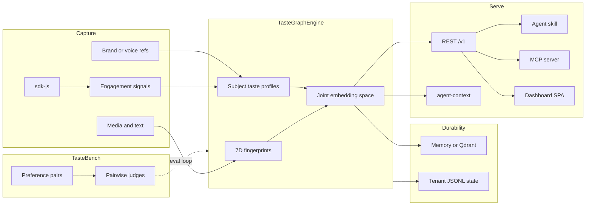
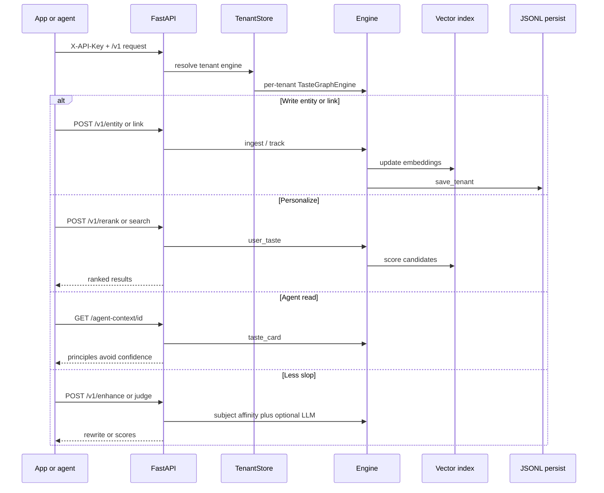
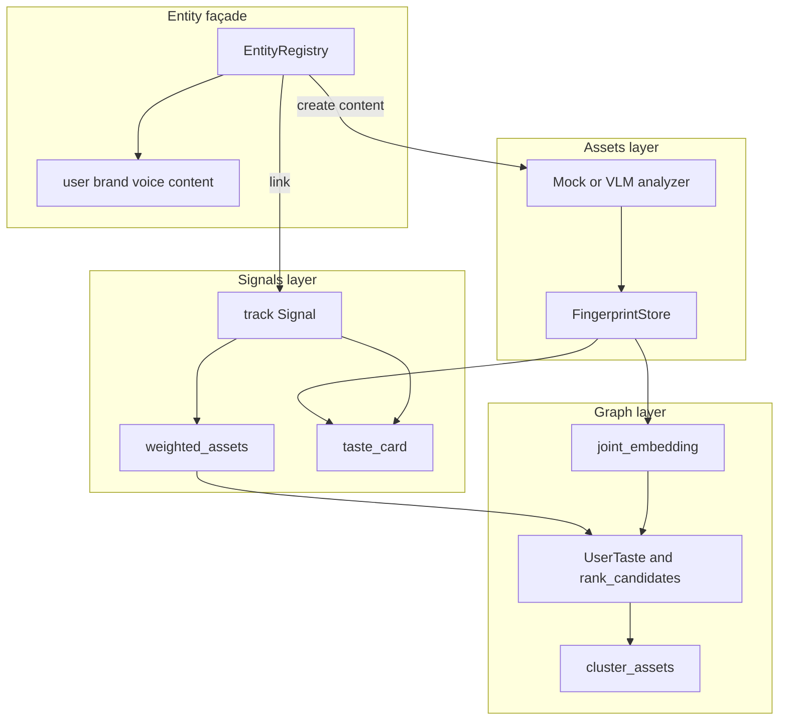
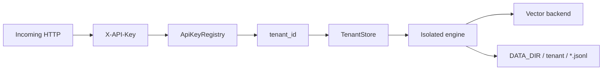
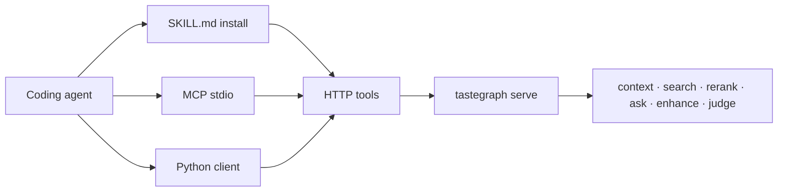

# TasteGraph system design

How the pieces in this repo fit together. Positioning: [taste-os.md](taste-os.md).
Try path: [agent-demo.md](agent-demo.md). API: [v1-api.md](v1-api.md).

---

## 1. System overview

Two products, one stack: **TasteBench** measures taste claims; **TasteGraph** runs preference
as infrastructure agents and apps can query.



**Read path (builders):** ingest content → link signals → `search` / `rerank` / `ask` /
`agent-context` → optional `enhance` / `judge`.

---

## 2. End-to-end request flow



---

## 3. Inside the engine



| Layer | Path | Role |
|-------|------|------|
| Assets | `tastebench/tastegraph/assets/` | Fingerprint content |
| Signals | `tastebench/tastegraph/signals/` | Engagement → profiles |
| Graph | `tastebench/tastegraph/graph/` | Embeddings, affinity, backends |
| Entities | `tastebench/tastegraph/entities/` | Typed subjects + links |
| API | `tastebench/tastegraph/api/` | HTTP, tenancy, rate limits |
| Persist | `tastebench/tastegraph/persist.py` | Per-tenant JSONL |
| Skills / MCP | `skills/tastegraph/`, `mcp_server.py` | Agent distribution |
| Web | `tastegraph-web/` | Landing + heatmap / playground / CI |

---

## 4. Tenancy and storage



- No API keys → shared **dev** tenant (local demos).
- With keys → one engine + one state directory per tenant.
- Vectors: in-process memory or Qdrant. Graph metadata: JSONL on disk.

---

## 5. How agents attach



Canonical loop: **context → rerank → judge**.

---

## 6. Repository layout

```text
taste-bench/
  tastebench/            # TasteBench eval + TasteGraph runtime
    tastegraph/
  tastegraph-web/        # Landing + dashboard
  sdk-js/                # Browser signal capture
  skills/tastegraph/     # Installable agent skill
  docs/                  # API, deploy, architecture
  data/                  # Sample assets, eval fixtures, persisted state
```

---

## 7. Critical path vs legacy

**Critical path:** durable graph → personalize API → skill / MCP → TasteBench.

Legacy or secondary modules (passport, packs, export, etc.) are not required for the builder
funnel; use [v1-api.md](v1-api.md) for the consumer contract.
