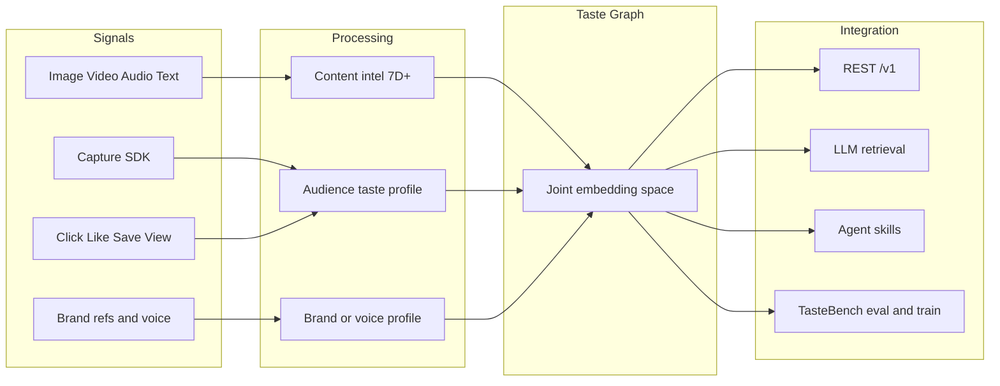
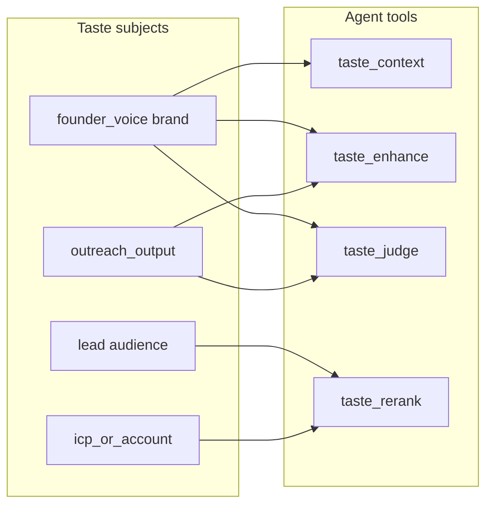

# TasteGraph — taste infrastructure for builders

> Open-source taste graph: turn behavior and content into structured preference you can
> **rerank**, **ask**, and expose as **agent tools** — with TasteBench so “less slop” is measurable.

This document defines the **positioning**, **architecture**, and **phased roadmap**.
It is grounded in today's TasteBench / TasteGraph code. For a slide-ready narrative
(problem → solution → GTM → monetization), see [pitch.md](pitch.md). For diagrams of how
the runtime is wired, see [architecture.md](architecture.md).

---

## 1. Positioning

**Lead story:** builders building personalization — a local-first taste graph with search,
rerank, ask, explain, and `agent_context`, packaged so agents call it via skills.

**Quality bar:** less slop — pairwise eval (TasteBench) plus optional enhance/judge when
drafts need an on-taste check.

**Same engine, optional subjects:** audience users are the default; brand/voice subjects reuse
the same APIs when drafts need an on-taste check (`enhance` / `judge`).

| Layer | Job |
|------|-----|
| **Taste graph** | Who prefers what, and *why* (signals + fingerprints → affinity) |
| **Personalization API** | `search` · `rerank` · `ask` · `explain` · `agent_context` |
| **Agent tools** | `GET /v1/skills` + `llm.txt` — wire without reinventing preference |
| **Less slop** | TasteBench pairs; `enhance` / `judge` when generating |

Agents (recommenders, copilots, coding agents, Rose, …) call TasteGraph at inference instead
of guessing. Builders self-host.

### Why builders need this

LLMs produce fluent defaults. Products and agents need a **structured preference memory**:

1. **Read** (`taste_context`) before deciding  
2. **Rank** (`taste_rerank` / `taste_search`) when choosing among options  
3. **Ask** (`taste_ask` / `taste_explain`) when the *why* matters  
4. **Judge** (`taste_judge`) when drafts must stay on-taste  

Without that, every app reinvents taste as ad-hoc prompting.

---

## 2. Principles

1. **Measurable** — every taste claim can be evaluated with pairwise judges (TasteBench).  
2. **Local-first** — run offline with a mock analyzer; swap in VLMs / vector DBs when ready.  
3. **Builder-first personalization** — lead with graph + rerank/ask; generation steer is secondary.  
4. **Agnostic subjects** — do not hard-wire ecommerce users or design brands; any typed subject works.  
5. **Agent-native** — tools + `llm.txt` so coding agents wire the SDK themselves.  
6. **Open & forkable** — self-host; no closed persona network required to get value.  

---

## 3. Architecture

```text
SIGNALS                    PROCESSING                     TASTE GRAPH
SDK / APIs                 Content intelligence           Joint embeddings
Engagement + media         Audience intelligence          Subject ↔ content links
Brand / voice refs         Brand intelligence             Output ↔ brand links
Design / outreach drafts   Eval pairs (TasteBench)        Cross-domain links (BYO)
        │                         │                              │
        └─────────────────────────┴──────────────────────────────┘
                                  │
                    API · LLM retrieval · Agent skills · TasteBench eval
```



**Content intelligence** fingerprints every asset across seven dimensions (semantic, emotional,
aesthetic, technical, contextual, intent, advanced) — the Galya-shaped VLM path already
scaffolded in [`tastebench/tastegraph/assets/schema.py`](../tastebench/tastegraph/assets/schema.py).

**Audience / brand intelligence** turns signals and references into subject taste vectors and
human-readable cards (principles, avoid, confidence).

**Taste Graph** places subjects and content in one embedding space so cold start works via
content similarity, not only click history.

---

## 4. Subject model (agent-agnostic)

Do not assume “user browsing a catalog.” Agents pass a **subject** (and optionally a second
subject to compare *against*).

| Kind | Role | Examples |
|------|------|----------|
| `audience` | Who is being personalized for | end-user, buyer, lead |
| `brand` | What “right” means stylistically | product brand, design system, **founder voice** |
| `account` / `icp` | Thesis / account fit | ICP profile, target account |
| `content` | Catalog / inventory | products, clips, docs, examples |
| `output` | Something to steer or judge | draft email, UI mock, outreach angle |

### Proposed API shape (roadmap — not all shipped)

Today's `/v1` loop uses `user_id` for audience taste
([docs/v1-api.md](v1-api.md)). The OS generalizes that to:

```text
subject_id          # e.g. lead_123, voice_founder, brand_acme
against_id?         # e.g. draft vs voice; lead vs icp
candidates[]?       # for rerank / judge
prompt?             # for enhance
```

Examples:

- `taste_rerank(subject_id=icp, candidates=[lead_a, lead_b])` — fit ranking  
- `taste_enhance(subject_id=founder_voice, prompt=draft)` — on-voice rewrite  
- `taste_judge(subject_id=brand, against_id=output_draft)` — send vs rewrite / wait  

Domain logic (sales, fashion, codegen) lives in the **agent**, not in Taste OS.

---

## 5. Surfaces (four faces, one engine)

| # | Surface | Job |
|---|---------|-----|
| 01 | **Discovery** | Rerank / search so on-taste items rise from the first signal |
| 02 | **Customer intelligence** | Human-readable taste cards, clusters, confidence, catalog heat |
| 03 | **Agent context** | Structured read for LLMs/agents (`agent_context` today) |
| 04 | **Generation steer** | Enhance prompts and judge outputs against brand/voice (roadmap) |

---

## 6. Agent contract

Proposed tools any agent (Rose, Cursor coding agents, recommenders) can call:

| Tool | Purpose |
|------|---------|
| `taste_context` | Structured taste read for a subject |
| `taste_search` | Discover content / entities by subject taste |
| `taste_rerank` | Reorder candidates for a subject |
| `taste_enhance` | Rewrite a prompt/draft toward a brand/voice subject |
| `taste_judge` | Score or pairwise-prefer outputs vs a subject |

**Agent-native packaging:** skill JSON / function-calling schemas (`GET /v1/skills`), plus
`llm.txt` so install-and-wire works from Claude Code, Codex, or Cursor.

---

## 7. Reference apps

### Founding Team — Rose ([foundingteam.co](https://foundingteam.co/))

Rose is a **consumer** of Taste OS, not the OS itself. Warm-first outbound needs judgment
about *fit*, *voice*, and *whether to send*.



| Rose need | Taste OS call |
|-----------|---------------|
| Who fits the thesis | `taste_rerank` / `taste_search` with ICP subject |
| Draft in founder voice | `taste_enhance` with `founder_voice` |
| Warm angle / why-them | `taste_context` on lead + account |
| Send vs wait / rewrite | `taste_judge` draft against voice + timing signals as content |

Sales workflow, CRM, and approval UX stay in Founding Team. Taste OS stays domain-agnostic.

### Coding / creative agent

- Brand or design-system subject from reference URLs / tokens  
- `taste_enhance` on codegen prompts; `taste_judge` on UI candidates  
- TasteBench pairs for “less slop” regression tests  

### Ecommerce / media personalization

- Audience subjects + catalog content  
- Discovery + CI dashboard + SDK capture (Galya-shaped path already closest to today)

---

## 8. Competitive map (absorb ideas, don’t clone)

| Player | Core bet | What Taste OS absorbs | What we refuse |
|--------|----------|----------------------|----------------|
| **Galya** | Content + engagement → taste graph → rerank / CI / agent context | Pipeline, 7D fingerprint, personalization surfaces | Closed hosted-only lock-in |
| **Taste Labs** | Brand/design judgment for generation | Optional brand/voice subjects + enhance/judge | Pretending we own their design research corpus |

**Differentiator:** open + local-first + **TasteBench-measurable** judgment — one stack
agents can fork and run beside their own product (including agents like Rose).

---

## 9. Phased roadmap

Vision only. Each phase should ship behind the same subject-agnostic contract.

### Phase A — Galya depth

- Enrich 7D fingerprint leaves toward true “40+ attribute” depth  
- Packaged **agent skill** artifacts (not only `agent_context` JSON)  
- Customer-intelligence metrics / clusters surfaced clearly in `tastegraph-web`  

### Phase B — Less slop (optional generation check)

- `brand` / `voice` subjects via reference ingest  
- `taste_enhance` and `taste_judge` endpoints  
- Not a separate product face — same personalization engine  

---

## 10. Non-goals

- Not a closed cultural knowledge graph of billions of entities  
- Not an advertising / media-buying platform  
- Not a hosted-only persona network you must join to personalize  
- Not a portable passport / OAuth identity product  
- Not a vertical sales or design product — those are **agents on top**  
- Not “outcompete every closed player on day one” — win on openness, measurability, and agent-callability  

---

## 11. Today vs tomorrow

Grounding the OS in what already exists in this repo:

| OS layer | Today | Tomorrow |
|----------|-------|----------|
| Signals | [`sdk-js`](../sdk-js/), `/track`, view/click/like/save/dismiss/**dwell/deep_*** | — |
| Content intel | 7D schema with **40+ leaves** + mock/VLM analyzer | Stronger default VLM path |
| Audience taste | `UserTaste`, `taste_card`, links via `/v1` | Generalized `subject_id` (audience) |
| Brand / voice | Built-in `brand` / `voice` kinds + `/v1/brand/ingest` | Richer reference ingest (URLs) later |
| Joint embedding | Heuristic concat in engine (uses richer tags) | Learned / improved joint space |
| Discovery | `/v1/search`, `/v1/rerank`, cold-start seed | Subject-agnostic rerank |
| Agent context | `agent_context` + **`GET /v1/skills`** + `skills/llm.txt` | — |
| Less slop | **`/v1/enhance`** + **`/v1/judge`** | Stronger default LLM path |
| Customer intelligence | `/metrics` + `/v1/clusters` + SPA **Intelligence** tab | Richer CI analytics |
| Eval / train | TasteBench + `tastegraph train` | — |
| UI | landing → login → dashboard (heatmap / playground / intelligence) | — |
| API docs | [v1-api.md](v1-api.md) | Extend as subjects generalize |

### Shipped checklist

- [x] Fingerprint leaf count ≥ 40 across seven dimensions  
- [x] Packaged agent skills (`tools.json`, `llm.txt`, `GET /v1/skills`)  
- [x] Customer Intelligence tab (metrics + clusters) in `tastegraph-web`  
- [x] `brand` / `voice` entity kinds + `POST /v1/brand/ingest`  
- [x] `POST /v1/enhance` and `POST /v1/judge`  
- [x] `dwell` / `deep_*` on the `/track` wire  

**Entry points in code today:**

- Engine façade: [`tastebench/tastegraph/api/engine.py`](../tastebench/tastegraph/api/engine.py)  
- Entity `/v1` API: [`tastebench/tastegraph/api/v1.py`](../tastebench/tastegraph/api/v1.py)  
- Fingerprint schema: [`tastebench/tastegraph/assets/schema.py`](../tastebench/tastegraph/assets/schema.py)  
- Pairwise eval: TasteBench core + [`docs/v1-api.md`](v1-api.md) for the graph API  

---

## Summary

**TasteGraph** is taste infrastructure for **builders**: a personalization graph (rerank, ask,
context) with **agent skills** and a **less-slop** quality bar via TasteBench (and optional
enhance/judge). Founding Team’s Rose (and any other agent) plugs in as a consumer — without
baking vertical product logic into the graph.
